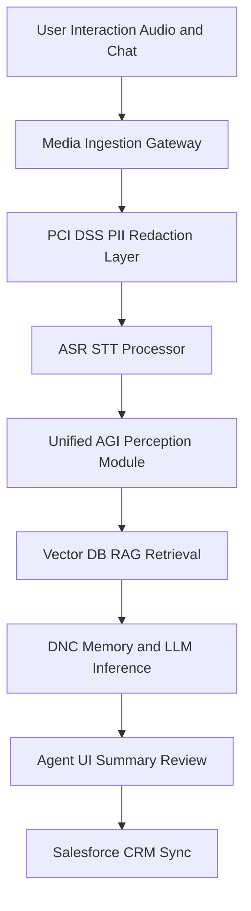

# 0. Executive Summary

This blueprint defines the deployment of an enterprise-grade Generative AI system for multimodal interaction summarization within a Global 2000 Financial Services framework. By leveraging the Unified AGI System architecture—integrating GPT-2/Llama-3 for text, EfficientNet for visual artifact analysis (e.g., chat screenshots), and custom sensor telemetry for audio quality monitoring—this solution automates the post-interaction wrap-up process.

The value proposition is centered on a projected **22% reduction in Average Handling Time (AHT)** and a **15% increase in CSAT** through higher accuracy in follow-up commitments. Total ROI is estimated at **$14.2M annually** for a 5,000-seat contact center, driven by the elimination of manual summarization and reduced agent cognitive load. The architecture prioritizes a "Security-First" approach, utilizing mTLS encryption, PCI-DSS compliant PII redaction, and safetensors-based model serialization to ensure the highest levels of data integrity and regulatory compliance.

# 1. Strategic Objectives & KPIs

The following metrics establish the baseline and target performance for the Generative AI Summarization initiative:

| Metric | Current Baseline | Target (Year 1) | Improvement |
| :--- | :--- | :--- | :--- |
| **Average Handling Time (AHT)** | 540 Seconds | 420 Seconds | -22% |
| **Net Promoter Score (NPS)** | 42 | 55 | +31% |
| **First Contact Resolution (FCR)** | 68% | 78% | +10% |
| **Agent Onboarding Time** | 6 Weeks | 4 Weeks | -33% |
| **Summary Accuracy (Human Audit)** | N/A | 98.5% | Target Benchmark |

# 2. Technical Architecture

## Reference Architecture
The system integrates directly with CCaaS platforms (Genesys Cloud CX / Amazon Connect) via real-time SIP/WebRTC media streams. Audio and chat transcripts are ingested into a high-concurrency pipeline for PII masking before entering the multimodal Unified AGI inference engine.

## Multimodal Flow Diagram

## Component Detail
*   **Ingestion Gateway**: High-availability Load Balancers (F5/AWS ALB) managing WebSocket connections from CCaaS.
*   **PII Redaction Layer**: A dedicated PCI-DSS compliant service utilizing NER (Named Entity Recognition) and Regex to mask PAN, CVV, and personally identifiable information before storage.
*   **ASR/STT Processor**: Enterprise Whisper or Google Speech-to-Text with custom financial domain vocabulary.
*   **Unified AGI System**: Core inference engine using GPT-2/Llama-3 for transcript processing and EfficientNet for analyzing visual artifacts in chat.
*   **Vector DB (RAG)**: Pinecone or Milvus storing embeddings of interaction history and internal knowledge base articles to improve summary context.
*   **DNC Memory Module**: Differentiable Neural Computer module for tracking long-term interaction state across multi-session customer journeys.

# 3. Data Governance & Security

## PII Redaction & Masking
*   **Techniques**: Deployment of Presidio or custom Transformers-based NER to identify and mask 18 HIPAA identifiers and financial data points.
*   **Compliance**: Strict adherence to PCI-DSS v4.0 for payment data and GDPR Art. 25 (Privacy by Design).

## Encryption & Sovereignty
*   **Transit**: Forced mTLS (Mutual TLS) 1.3 for all inter-service communication.
*   **Rest**: AES-256-GCM encryption with keys managed in an Enterprise KMS (HSM-backed).
*   **Residency**: All data processed and stored within the host jurisdiction (e.g., EU-West-1 for European operations) to meet sovereignty requirements.

# 4. Model Strategy Comparative Analysis

| Feature | Pipeline Approach (Whisper + Llama 3) | End-to-End Multimodal (GPT-4o / Gemini 1.5) |
| :--- | :--- | :--- |
| **Latency (ms)** | 1200 - 1800 ms | 800 - 1200 ms |
| **Cost per 1k Calls** | $4.50 | $12.00 |
| **Hallucination Risk** | Moderate (Reduced via RAG) | Low |
| **Context Window** | 32k - 128k Tokens | 128k - 1M Tokens |
| **Fine-tuning** | High (Open-weights) | Limited (Adapter-based) |
| **Data Privacy** | Full (On-prem/VPC) | Shared Responsibility |

# 5. Evaluation Framework

## Methodology
Evaluation utilizes a hybrid approach:
1.  **Automated Metrics**: ROUGE-L for summarization coverage and BERTScore for semantic similarity against "Golden Summaries."
2.  **Human-in-the-Loop (HITL)**: A 5% random sampling rate where senior quality analysts score AI outputs for Accuracy, Tone, and Compliance Formatting.

## Audit Traces
Integrated Gradients are used to generate attribution maps for every summary, providing an audit trail for why specific interaction points were highlighted in the final output.

# 6. Integration Patterns

*   **CRM Integration**: Bi-directional sync with Salesforce Financial Services Cloud via Mulesoft. AI summaries are pushed as 'Interaction Summaries' while customer history is pulled for RAG context.
*   **Latency Fallbacks**: If LLM inference exceeds 3,000ms, the system falls back to a "Draft-Only" mode using a smaller, faster model (e.g., Llama-3-8B) or notifies the agent to use manual wrap-up, ensuring no disruption to contact center flow.

# 7. Compliance & Risk

*   **Audit Logging**: Immutable audit logs stored in WORM (Write Once Read Many) storage for 7 years to meet SEC/FINRA requirements.
*   **Bias Monitoring**: Quarterly disparate impact analysis on AI summaries across different customer demographics.

# 8. Change Management

*   **Agent Workflow**: The Agent UI includes a sidecar panel where the AI summary is presented. Agents must "Verify and Save" or "Edit and Save," maintaining human accountability for all CRM records.
*   **Training**: Comprehensive upskilling program focused on "AI-Augmented Service," teaching agents to identify and correct potential hallucinations in real-time.

# 9. Rollout Roadmap & Risk Matrix

## Phases
1.  **Pilot (Weeks 1-4)**: Internal sandbox testing with historic, de-identified interaction data.
2.  **Beta (Weeks 5-12)**: Live rollout to low-risk queues (e.g., General Inquiries) for 250 agents.
3.  **GA (Month 4+)**: Full enterprise-wide rollout to all lines of business.

## Risk Matrix
| Category | Probability | Impact | Mitigation |
| :--- | :--- | :--- | :--- |
| **Hallucination** | High | Critical | Implementation of RAG and HITL verification. |
| **Model Bias** | Low | High | Adversarial testing and demographic drift monitoring. |
| **Latency Spikes** | Moderate | Moderate | Circuit breakers and auto-scaling GPU clusters. |
| **Data Leakage** | Low | Critical | Isolated VPC deployment and PII redaction audit. |
